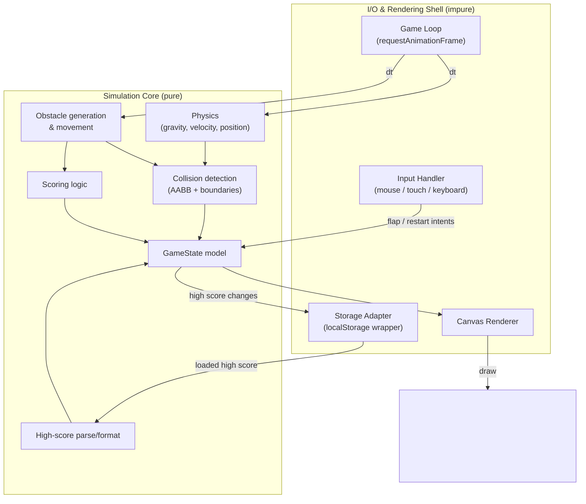

# Design Document: Flappy Kiro

## Overview

Flappy Kiro is a single-page, browser-based endless-scroller game in the style of Flappy Bird. The Player controls a blue Superman-style Character that flaps to rise against gravity and must navigate through gaps in green top-and-bottom Obstacle_Pairs that scroll from right to left. The game tracks a Score for each Obstacle_Pair cleared and persists a High_Score in `localStorage` across sessions.

The design targets a **plain HTML/CSS/JavaScript** implementation with **HTML5 Canvas** for rendering and **`requestAnimationFrame`** for the game loop. This choice is deliberate: the workspace is a fresh project with no framework dependencies (only `assets/`, `img/`, `README.md`, and `LICENCE.md`), so a zero-build, dependency-free approach keeps the game trivially runnable by opening a single HTML file and avoids introducing a toolchain the project does not otherwise need.

### Key Design Decisions

| Decision | Rationale |
| --- | --- |
| HTML5 Canvas rendering | Efficient immediate-mode 2D drawing for a 60 fps game loop; simpler than DOM/CSS sprite manipulation for scrolling obstacles and physics. |
| `requestAnimationFrame` loop | Browser-synced frame timing, automatic throttling when the tab is hidden, and access to a high-resolution timestamp for delta-time integration. |
| Delta-time physics integration | Requirements specify accelerations/velocities in px/s and px/s²; integrating against real elapsed time makes behavior frame-rate independent. |
| Separation of **pure logic** from **rendering/I-O** | Physics, collision, scoring, obstacle generation, and high-score parsing are implemented as pure functions so they can be unit- and property-tested without a canvas or DOM. |
| Vanilla JS, no dependencies for runtime | No existing framework in the workspace; keeps the deliverable a static file set. A dev-only property-testing library is added for tests (see Testing Strategy). |
| Optional audio/sprite assets | `assets/jump.wav`, `assets/game_over.wav`, and `assets/ghosty.png` may be wired in for polish, but gameplay and all acceptance criteria are satisfiable without them. Audio is best-effort and never blocks state transitions. |

### Research Notes

- **`requestAnimationFrame` delta time**: The callback receives a `DOMHighResTimeStamp`. Computing `dt = (now - last) / 1000` yields seconds, which pairs directly with the px/s and px/s² constants in the requirements. To avoid a large physics jump after the tab is backgrounded (rAF pauses while hidden), the delta is clamped to a maximum step (e.g., 1/30 s). Reference: [MDN — window.requestAnimationFrame](https://developer.mozilla.org/en-US/docs/Web/API/Window/requestAnimationFrame).
- **`localStorage` fallibility**: `localStorage.setItem` can throw (e.g., `QuotaExceededError`, or `SecurityError` in private-browsing / disabled-storage contexts), and `getItem` returns `null` when absent. All access is wrapped in try/catch so failures degrade gracefully per Requirements 6.5 and 6.7. Reference: [MDN — Window.localStorage](https://developer.mozilla.org/en-US/docs/Web/API/Window/localStorage).
- **AABB collision**: Axis-aligned bounding-box overlap is the standard, cheap primitive for rectangular obstacles and a rectangular character bound. Two boxes overlap iff they overlap on both axes. A ≥1px overlap threshold (Requirement 4.1) is expressed with strict inequality on integer/float extents.
- **Input coalescing**: Mouse click (press+release), touch tap, and spacebar all map to a single `flap()` intent. Handlers call `preventDefault()` where appropriate (spacebar to avoid page scroll; touch to avoid synthetic mouse events / double-firing).

## Architecture

The game is organized into a thin rendering/I-O shell around a pure simulation core.



### Layering

1. **Simulation Core (pure, testable):** Given the current `GameState` and a delta time `dt`, produces the next `GameState`. No DOM, no `localStorage`, no timers, no randomness except through an injected RNG. This is where every physics, collision, scoring, and generation rule lives.
2. **Shell (impure):** Owns the canvas, the rAF loop, event listeners, and the storage adapter. It reads real time, gathers input intents, invokes the core `step()`, then renders and persists side effects.

### The Game Loop

```
onFrame(now):
    dt = clamp((now - last) / 1000, 0, MAX_DT)   // MAX_DT = 1/30
    last = now
    intents = drainInputQueue()                  // flaps / restart collected since last frame
    state = step(state, dt, intents, rng)         // pure
    if state.highScore changed: storage.writeHighScore(state.highScore)
    render(ctx, state)
    requestAnimationFrame(onFrame)
```

`step()` behavior depends on `Game_State`:
- **Ready:** ignores gravity/movement; a flap intent transitions to Running (Req 7.2). Displays start instruction (Req 7.1).
- **Running:** applies gravity, applies flaps, moves/generates/removes obstacles, detects collisions, updates score.
- **Game_Over:** freezes obstacle movement and physics (Req 4.4); a restart intent resets to Ready (Req 7.3); displays restart instruction (Req 7.4).

## Components and Interfaces

### Constants

```js
const CONFIG = {
  PLAY_WIDTH: 480,          // logical Play_Area width in px
  PLAY_HEIGHT: 640,         // logical Play_Area height in px
  GROUND_HEIGHT: 0,         // Ground occupies bottom edge; y = PLAY_HEIGHT is Ground line
  GRAVITY: 1200,            // px/s^2  (Req 2.1)
  MAX_FALL_SPEED: 700,      // px/s    (Req 2.2)
  FLAP_VELOCITY: -400,      // px/s, upward = negative y (Req 2.3)
  CHAR_X: 120,              // fixed horizontal center; 120/480 = 25% <= 40% (Req 1.4)
  CHAR_WIDTH: 40,
  CHAR_HEIGHT: 40,
  OBSTACLE_WIDTH: 70,
  SCROLL_SPEED: 180,        // px/s within [100,300] (Req 3.1)
  OBSTACLE_SPACING: 300,    // px within [200,400] (Req 3.2)
  GAP_HEIGHT: 200,          // >= 1.5 * CHAR_HEIGHT = 60 (Req 3.3); generous for playability
  GAP_CENTER_MIN_FRAC: 0.10,// Req 3.4
  GAP_CENTER_MAX_FRAC: 0.90,// Req 3.4
  SCORE_BAND_TOP_FRAC: 0.85,// Score_Display in lower 15% (Req 1.6)
  HS_STORAGE_KEY: 'flappyKiro.highScore',
  MAX_DT: 1 / 30,
};
```

`GAP_CENTER_MIN_FRAC`/`MAX_FRAC` are further constrained at generation time so the whole Gap stays inside the Play_Area while its center honors the 10–90% band.

### Simulation Core API (pure)

```ts
// Coordinate convention: origin top-left, +y downward. Upward velocity is negative.

interface Vec { x: number; y: number; }

interface Character {
  x: number;        // horizontal center (constant = CONFIG.CHAR_X)
  y: number;        // vertical center
  vy: number;       // vertical velocity, px/s
  width: number;
  height: number;
}

interface ObstaclePair {
  id: number;       // unique, monotonically increasing
  x: number;        // left edge of the pair (both obstacles share x)
  width: number;
  gapCenterY: number;
  gapHeight: number;
  scored: boolean;  // whether this pair has already awarded a point (Req 5.4)
}

type GameStateName = 'Ready' | 'Running' | 'GameOver';

interface GameState {
  phase: GameStateName;
  character: Character;
  obstacles: ObstaclePair[];
  score: number;
  highScore: number;
  distanceSinceLastSpawn: number; // drives spacing (Req 3.2)
  nextObstacleId: number;
  rngSeedNote: string;            // RNG is injected, not stored
}

// RNG abstraction so generation is deterministic in tests.
type Rng = () => number; // returns float in [0, 1)

// --- Pure functions ---

// Physics integration for one step while Running.
function applyPhysics(ch: Character, dt: number): Character;
// vy' = clamp(vy + GRAVITY*dt, -Infinity, MAX_FALL_SPEED); y' = y + vy'*dt

// Apply a single flap (sets vy to FLAP_VELOCITY).
function applyFlap(ch: Character): Character;

// Move all obstacles left by SCROLL_SPEED*dt.
function moveObstacles(obs: ObstaclePair[], dt: number): ObstaclePair[];

// Drop obstacles fully past the left edge (x + width < 0).  (Req 3.5)
function pruneObstacles(obs: ObstaclePair[]): ObstaclePair[];

// Decide whether/where to spawn a new pair based on distanceSinceLastSpawn.
function maybeSpawn(state: GameState, dt: number, rng: Rng): GameState;

// AABB overlap test with >=1px threshold.  (Req 4.1)
function rectsOverlap(a: Rect, b: Rect): boolean;

// True if character collides with any obstacle, ground, or ceiling.  (Req 4.1-4.3)
function detectCollision(ch: Character, obs: ObstaclePair[], playHeight: number): boolean;

// Count newly-passed, unscored pairs; mark them scored. Returns {obstacles, gained}. (Req 5.1,5.4)
function updateScoring(ch: Character, obs: ObstaclePair[]): { obstacles: ObstaclePair[]; gained: number };

// The master transition function used by the loop.
function step(state: GameState, dt: number, intents: Intents, rng: Rng): GameState;

interface Intents { flap: boolean; restart: boolean; }
```

### `step()` semantics (per phase)

- **Ready:** If `intents.flap`, return a Running state (character reset, score 0). Ignore everything else. (Req 7.2)
- **Running:**
  1. If `intents.flap`, `character = applyFlap(character)`. (Req 2.3)
  2. `character = applyPhysics(character, dt)`. (Req 2.1, 2.2)
  3. `obstacles = moveObstacles(obstacles, dt)`. (Req 3.1)
  4. `state = maybeSpawn(state, dt, rng)`. (Req 3.2–3.4)
  5. `obstacles = pruneObstacles(obstacles)`. (Req 3.5)
  6. `{obstacles, gained} = updateScoring(character, obstacles)`; `score += gained`. (Req 5.1, 5.4)
  7. If `detectCollision(...)`, transition to Game_Over: freeze obstacles, update high score. (Req 4.1–4.5, 6.1)
  8. Flap/restart intents beyond the flap already consumed do not alter score/position beyond the above. (Req 7.5)
- **Game_Over:** Obstacles do not move and physics is not applied (Req 4.4). If `intents.restart`, return a fresh Ready state (score 0, no obstacles, character at start). (Req 7.3)

Ordering note (Req 5.5): scoring is evaluated using the pre-collision `scored` flags, but a point is only awarded when the character's center has **passed** the pair center without the pair being in collision at that moment. Because collision ends the game in the same cycle, a pair the character crashes into before reaching its center is never marked scored, so no point is awarded for it.

### Input Handler (shell)

```
- 'mousedown'+'mouseup' within canvas  -> enqueue flap (Req 2.4)
- 'touchstart' (tap) within canvas     -> enqueue flap; preventDefault (Req 2.5)
- 'keydown' Space                      -> enqueue flap; preventDefault (Req 2.6)
```

The same intents double as **restart** input when phase is Game_Over, and as **start** input when phase is Ready. Intents are queued and drained once per frame so multiple events between frames coalesce predictably. When phase is not Running, flap intents that would change physics are ignored by `step()` (Req 2.7, 7.5).

### Renderer (shell)

Draws, in order: light-green background fill (Req 1.1) → white cloud shapes (Req 1.2) → obstacle pairs as green rectangles (Req 1.5) → the blue caped Character (Req 1.3) → Score_Display text in the lower 15% band (Req 1.6) → phase overlays (start instruction for Ready per Req 7.1; game-over + restart instruction for Game_Over per Req 4.5, 7.4).

### Storage Adapter (shell)

```ts
function readHighScore(storage: StorageLike): number;   // parse+validate; 0 on any failure (Req 6.3-6.5)
function writeHighScore(storage: StorageLike, value: number): boolean; // try/catch; returns success (Req 6.2, 6.7)

// parseHighScore is pure and independently testable:
function parseHighScore(raw: string | null): number;    // non-negative integer or 0
```

`parseHighScore` returns the value only when `raw` parses as a non-negative integer; otherwise `0`. `writeHighScore` wraps `setItem` in try/catch and returns `false` on failure without throwing, so gameplay continues and the in-session High_Score is retained (Req 6.7).

## Data Models

### Rect (bounding region)

```ts
interface Rect { x: number; y: number; width: number; height: number; }
// Extents: left=x, right=x+width, top=y, bottom=y+height.
```

The Character's bounding Rect is derived from its center: `{ x: cx - w/2, y: cy - h/2, width: w, height: h }`. Each ObstaclePair yields two Rects:
- Top obstacle: `{ x, y: 0, width, height: gapCenterY - gapHeight/2 }`
- Bottom obstacle: `{ x, y: gapCenterY + gapHeight/2, width, height: PLAY_HEIGHT - (gapCenterY + gapHeight/2) }`

### Gap generation

For a spawned pair, `gapCenterY` is drawn from the 10–90% band and then clamped so the full gap fits: `gapCenterY ∈ [max(0.10·H, gapHeight/2), min(0.90·H, H − gapHeight/2)]` (Req 3.3, 3.4). `gapHeight = GAP_HEIGHT ≥ 1.5 · CHAR_HEIGHT` (Req 3.3).

### Persisted model (localStorage)

A single key `flappyKiro.highScore` holds the stringified non-negative integer High_Score. Nothing else is persisted.

## Correctness Properties

*A property is a characteristic or behavior that should hold true across all valid executions of a system — essentially, a formal statement about what the system should do. Properties serve as the bridge between human-readable specifications and machine-verifiable correctness guarantees.*

The following properties were derived from the acceptance criteria via the prework analysis. Each targets pure simulation-core logic and is intended for property-based testing with a minimum of 100 generated inputs per property.

### Property 1: Fall speed is capped

*For any* Character with any vertical velocity and any positive `dt`, after applying physics the resulting downward vertical velocity SHALL NOT exceed `MAX_FALL_SPEED` (700 px/s).

**Validates: Requirements 2.2**

### Property 2: Gravity increases downward velocity below the cap

*For any* Character whose velocity after gravity would remain below the cap, and any positive `dt`, applying physics SHALL increase the vertical velocity by exactly `GRAVITY · dt`.

**Validates: Requirements 2.1**

### Property 3: Flap sets a fixed upward velocity

*For any* Character with any prior vertical velocity, applying a flap SHALL set the vertical velocity to exactly `FLAP_VELOCITY` (−400 px/s), independent of the prior value.

**Validates: Requirements 2.3**

### Property 4: Flap is ignored outside the Running state

*For any* game state whose phase is not Running and any Character velocity, processing a flap intent SHALL leave the Character's vertical velocity unchanged.

**Validates: Requirements 2.7, 7.5**

### Property 5: Obstacles scroll leftward at the configured speed

*For any* set of obstacles and any positive `dt`, moving them SHALL decrease each obstacle's `x` by exactly `SCROLL_SPEED · dt`, preserving their count and relative order.

**Validates: Requirements 3.1**

### Property 6: Generated gaps satisfy size and placement constraints

*For any* RNG output, a generated Obstacle_Pair SHALL have a gap height of at least `1.5 · CHAR_HEIGHT`, a gap center within 10–90% of the Play_Area height, and a gap fully contained within the Play_Area.

**Validates: Requirements 3.3, 3.4**

### Property 7: Consecutive spawn spacing stays within bounds

*For any* sequence of update steps while Running, the horizontal distance between consecutive spawned Obstacle_Pairs SHALL be between 200 and 400 pixels.

**Validates: Requirements 3.2**

### Property 8: Off-screen obstacles are pruned

*For any* set of obstacles, after pruning, no remaining obstacle SHALL be completely past the left edge (i.e., every remaining obstacle has `x + width ≥ 0`).

**Validates: Requirements 3.5**

### Property 9: Collision is detected exactly on bounding-region overlap

*For any* Character position and any set of obstacles, `detectCollision` SHALL return true if and only if the Character's bounding Rect overlaps an obstacle Rect by at least 1 pixel, or the Character contacts/crosses the Ground or Ceiling.

**Validates: Requirements 4.1, 4.2, 4.3**

### Property 10: Passing a pair scores exactly once

*For any* Character and any set of obstacles, running scoring across arbitrarily many update steps SHALL award at most one point per Obstacle_Pair, and SHALL award that point only after the Character's center has passed the pair's center.

**Validates: Requirements 5.1, 5.4**

### Property 11: A crashed-into pair awards no point

*For any* Obstacle_Pair the Character collides with before its center reaches the pair's center, the Score SHALL NOT increase for that pair.

**Validates: Requirements 5.5**

### Property 12: Reset to Ready zeroes the score and clears obstacles

*For any* Game_Over state, applying a restart SHALL produce a Ready state whose score is 0, whose obstacle list is empty, and whose Character is at the starting position.

**Validates: Requirements 7.3, 5.2**

### Property 13: High score is the running maximum

*For any* sequence of completed sessions with arbitrary end scores, after each Game_Over transition the High_Score SHALL equal the maximum of the previous High_Score and the session's Score.

**Validates: Requirements 6.1**

### Property 14: High-score parsing yields a non-negative integer or zero

*For any* string (including `null`, empty, non-numeric, negative, floating-point, or overflowing values), `parseHighScore` SHALL return a non-negative integer, and SHALL return 0 for any value that is not a valid non-negative integer.

**Validates: Requirements 6.4, 6.5**

## Error Handling

| Condition | Handling | Requirement |
| --- | --- | --- |
| `localStorage.getItem` returns `null` (no stored high score) | `parseHighScore(null)` returns 0; High_Score initialized to 0. | 6.4 |
| Stored high score is non-numeric, negative, floating, or otherwise unparseable | `parseHighScore` returns 0; game continues with no error surfaced to the Player. | 6.5 |
| `localStorage.setItem` throws (quota, private mode, disabled storage) | Caught by `writeHighScore`; returns `false`; in-session High_Score retained; gameplay uninterrupted. | 6.7 |
| `localStorage` entirely unavailable (access throws) | Storage adapter treats reads as 0 and writes as no-ops; game remains fully playable for the session. | 6.5, 6.7 |
| Large delta time after tab is backgrounded | `dt` clamped to `MAX_DT` (1/30 s) to prevent a physics tunnel/jump through obstacles. | (robustness) |
| Audio asset fails to load/play | Playback wrapped in try/catch and ignored; never blocks a state transition. | (robustness) |
| Input event fires between frames / multiple events per frame | Intents queued and drained once per frame; coalesced deterministically. | 2.4–2.6, 7.5 |

## Testing Strategy

The simulation core is pure, which makes it directly amenable to both example-based unit tests and property-based tests. The rendering, input, and storage shell is validated with example/integration-style tests using DOM mocks.

### Property-Based Tests

PBT **is appropriate** here because the physics, collision, scoring, obstacle generation, and high-score parsing are pure functions with universal properties over large input spaces (arbitrary velocities, positions, obstacle layouts, and strings).

- **Library:** [fast-check](https://github.com/dubzzz/fast-check) — the standard property-based testing library for JavaScript/TypeScript — run under a test runner such as Vitest or Jest. We will **not** implement property testing from scratch.
- **Iterations:** Each property test configured to run a **minimum of 100 generated inputs** (`fc.assert(..., { numRuns: 100 })` or higher).
- **Tagging:** Each property test is tagged with a comment referencing its design property, in the format:
  `// Feature: flappy-kiro, Property {number}: {property_text}`
- **Coverage:** One property-based test per Correctness Property (Properties 1–14). Generators cover edge cases (empty obstacle lists, zero/large velocities, boundary gap positions, `null`/garbage high-score strings).

### Unit Tests (example-based)

Focused examples and edge/error cases that complement the property tests:
- Physics: a single flap immediately after a fast fall sets `vy = −400` (Req 2.3).
- Collision: character exactly 1px into an obstacle triggers collision; a 0px touch at the shared edge does not, per the ≥1px rule (Req 4.1).
- Scoring: character center exactly at a pair center — verifies the "passed the center" boundary (Req 5.1).
- Boundaries: character touching Ground / Ceiling ends the game (Req 4.2, 4.3).
- State transitions: Ready→Running on flap (Req 7.2); Running ignores restart (Req 7.5); Game_Over→Ready on restart (Req 7.3).

### Integration / Mock-Based Tests (shell)

- **Storage:** `readHighScore`/`writeHighScore` against a mock `StorageLike` — returns 0 when empty (Req 6.4), 0 on garbage (Req 6.5), persists on change (Req 6.2), and does not throw when `setItem` throws (Req 6.7).
- **Input:** simulated `mousedown`/`mouseup`, `touchstart`, and `keydown` Space events each enqueue exactly one flap intent (Req 2.4–2.6).
- **Loop:** a mocked `requestAnimationFrame` advancing fixed deltas verifies that Running progresses physics and Game_Over freezes obstacles (Req 4.4).

### Rendering Checks (example-based)

Rendering correctness (Req 1.1–1.6, 4.5, 7.1, 7.4) is verified with lightweight assertions against a mocked 2D context (recording draw calls) plus manual visual confirmation, since exact pixel layout and aesthetics are not meaningfully property-testable. Verified points: background fill color, at least one cloud drawn, character drawn in the leftmost 40% band, score text rendered in the lower 15% band, and the correct instruction overlay per phase.
